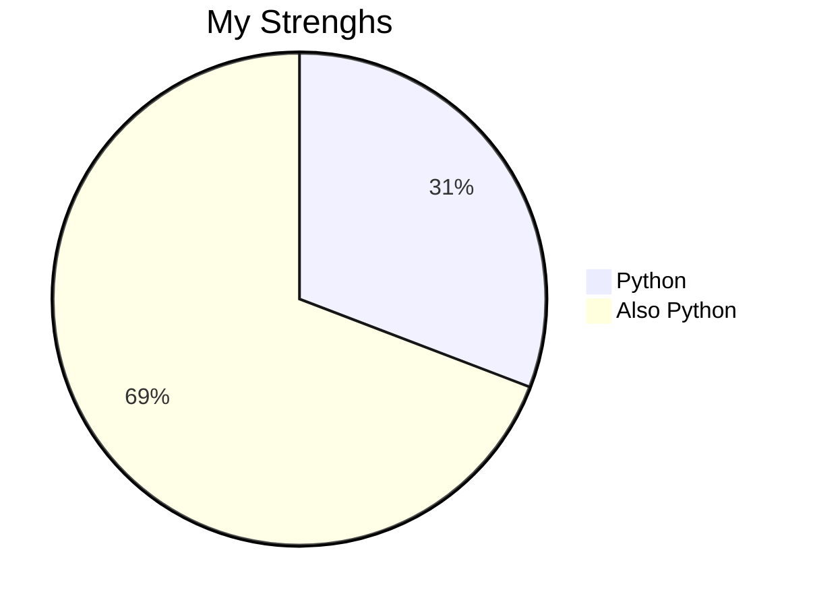
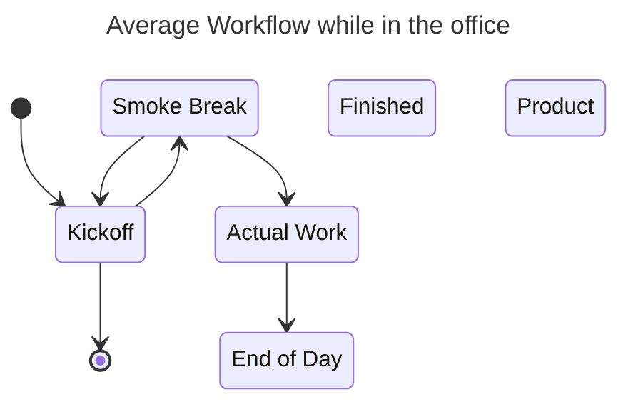

<h1 align="center">Hi 👋, I'm Eric</h1>
<h3 align="center">A developer from Germany</h3>

  

- 🔭 I’m currently working on [fortneit](https://github.com/EricTelekom/fortneit)

- 🌱 I’m currently learning **AI, Selenium, Docker**

- 👨‍💻 All of my projects are available at [https://github.com/EricTelekom](https://github.com/EricTelekom)

- 💬 Ask me about **Python**

- 📫 How to reach me **ericdirla1000@gmail.com**

- ⚡ Fun fact **yes**

<h3 align="left">Connect with me:</h3>

<h3 align="left">Languages and Tools:</h3>

                  

